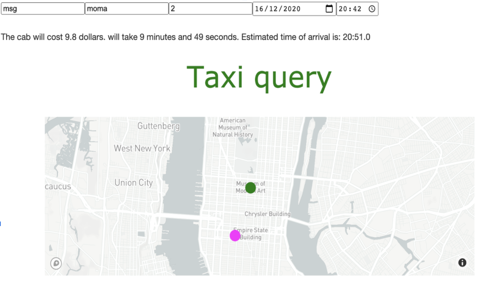

# Taxi vs Uber in NYC

**Introduction:**
The aim of this project is to use all of the skills learnt in the past 9 weeks in the Data Analytics Bootcamp at Ironhack to analyse data found online of taxis and Ubers in New york between 2013 and 2015 and then use this data to create an online dashboard which will let users predict the price and length for a ride between any two places in the Big Apple.

**Exploratory Data Analysis:**
To carry out the EDA and data cleaning I used Jupyter notebooks in addition to libraires like NumPy, Pandas, Plotly, MatplotLib, Seaborn and GeoPandas. The results and findings of this data analysis can be found in this presentation: (https://docs.google.com/presentation/d/11VczOvtZtZhdqRwAPF2q69RuavelsnJj0gK1op9P0Yc/edit#slide=id.p3). After the data was cleaned it was used to create the models for price and length prediction.

**Modelling:**
I used several regression models for the prediction of price and length taking account factors such as pickup and dropoff location, time of day and passenger number. The procedure which was followed for the modelling can be seen in the pred_func.py and prediction_pipeline.py files.

**Deploying on Dash:**
Finally, once the model worked correctly we deployed this using Dash, hosting an online dashboard where users can visualise their trip with predicted length and price.

**Data:**
The data source for this project is Google Cloud's competition on kaggle to predict price for taxi rides (https://www.kaggle.com/c/new-york-city-taxi-fare-prediction)

**Technologies used:**
Python, Pandas, Numpy, GeoPandas, Plotly, Dash, SKLearn, Seaborn
